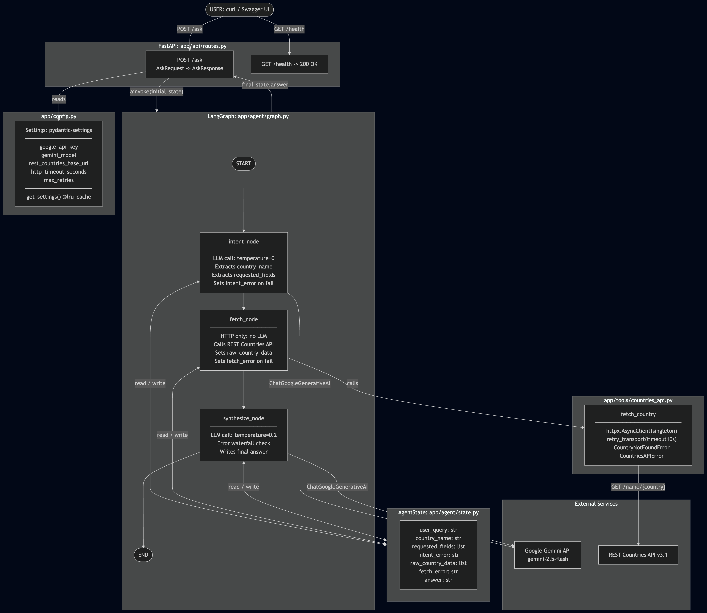

# 🌍 Country Information AI Agent

An AI agent that answers natural language questions about countries using live data from the [REST Countries API](https://restcountries.com). Built with **LangGraph**, **FastAPI**, and **Google Gemini**.

> **Live Demo:** [varunnn30-cloudeagle-assignment-rest-countries.hf.space/docs](https://varunnn30-cloudeagle-assignment-rest-countries.hf.space/docs)

---

## Architecture



---

## Project Structure

```
agent/
├── app
│   ├── agent
│   │   ├── graph.py           # Compiled StateGraph
│   │   ├── nodes.py           # The 3 LangGraph node functions
│   │   └── state.py           # All settings via pydantic-settings
│   ├── api
│   │   └── routes.py          # FastAPI routes /ask and /health
│   ├── config.py               # All settings via pydantic-settings
│   └── tools
│       └── countries_api.py   # Async HTTP client for REST Countries API
├── conftest.py                # Required for pytest
├── Dockerfile                  # Dockerfile for huggingface deployment
├── main.py                    # App entrypoint
├── pytest.ini                 # pytest config file
├── README.md
├── requirements.txt
├── sample-response.json
└── tests
    └── test_nodes.py          # Unit tests
```

---

## Local Setup

### Prerequisites

- Python 3.10+
- [Google Gemini API key](https://aistudio.google.com)

### 1. Clone the repository

```bash
git clone https://github.com/varunsha30/cloudeagle-python-dev-assessment.git
cd cloudeagle-python-dev-assessment
```

### 2. Create and activate a virtual environment

```bash
python -m venv venv

# macOS / Linux
source venv/bin/activate

# Windows
venv\\Scripts\\activate
```

### 3. Install dependencies

```bash
pip install -r requirements.txt
```

### 4. Configure environment variables

```bash
cp .env.example .env
```

Open `.env` and add your Gemini API key:

```bash
GOOGLE_API_KEY=AIzaSy...your-key-here
```

### 5. Start the server

```bash
uvicorn main:app --reload
```

The API is now running at `http://localhost:8000`.

---

## Usage

### Interactive API docs (Swagger UI)

Open `http://localhost:8000/docs` in your browser to explore and test the API interactively.

### Example requests

**What is the population of Germany?**
```bash
curl -X POST http://localhost:8000/ask \\
  -H "Content-Type: application/json" \\
  -d \'{"question": "What is the population of Germany?"}\'
```
```json
{
  "answer": "Germany has a population of approximately 83,240,000.",
  "country": "Germany"
}
```

**What currency does Japan use?**
```bash
curl -X POST http://localhost:8000/ask \\
  -H "Content-Type: application/json" \\
  -d \'{"question": "What currency does Japan use?"}\'
```
```json
{
  "answer": "Japan uses the Japanese Yen (¥) as its official currency.",
  "country": "Japan"
}
```

**What is the capital and population of Brazil?**
```bash
curl -X POST http://localhost:8000/ask \\
  -H "Content-Type: application/json" \\
  -d \'{"question": "What is the capital and population of Brazil?"}\'
```
```json
{
  "answer": "Brazil\'s capital is Brasília, and it has a population of approximately 215,313,498.",
  "country": "Brazil"
}
```

### Health check

```bash
curl http://localhost:8000/health
# {"status": "ok"}
```

---

## Running Tests

```bash
pytest tests/ -v
```

Tests mock both the LLM and the HTTP client — no API key or internet connection needed.

---

## Production Design Decisions

| Concern               | Approach                                                                                                              |
| --------------------- | --------------------------------------------------------------------------------------------------------------------- |
| Config validation     | `pydantic-settings` validates all env vars at startup — fails fast if anything is missing                             |
| HTTP connection reuse | Shared `httpx.AsyncClient` with retry transport, closed cleanly on shutdown                                           |
| Error handling        | Typed exceptions (`CountryNotFoundError`, `CountriesAPIError`) cascade through a state waterfall — no silent failures |
| LLM determinism       | `temperature=0` on the intent node for consistent JSON extraction                                                     |
| Graph compilation     | Compiled once via `@lru_cache`, reused for every request                                                              |
| JSON reliability      | Gemini intent node uses structured prompt + `temperature=0` for reliable JSON output                                  |

---

## Known Limitations & Trade-offs

- **Single country per query** — the agent handles one country at a time. Multi-country queries ("Compare Germany and France") are not supported.
- **No caching** — every request hits the REST Countries API. A simple in-memory TTL cache (e.g. `cachetools`) would reduce latency significantly in production.
- **LLM dependency** — intent parsing and synthesis both require a Gemini API call. If the API is down, the agent fails. A fallback (e.g. regex-based intent parser) would improve resilience.
---